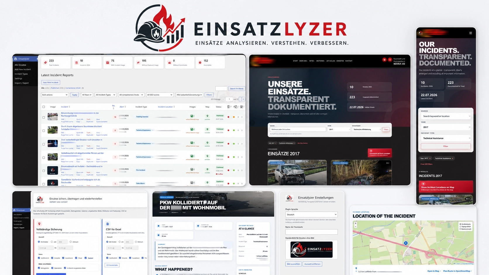

<p align="center">
  <a href="docs/einsatzlyzer-programmvorschau-github.webp">
    
  </a>
</p>

# Einsatzlyzer

<p align="center">
  <strong>Modern WordPress incident management for fire departments and emergency services.</strong><br>
  <strong>Moderne WordPress-Einsatzverwaltung für Feuerwehren und Hilfsorganisationen.</strong>
</p>

<p align="center">
  <a href="#english">English</a> · <a href="#deutsch">Deutsch</a> ·
  <a href="CHANGELOG.md">Changelog</a> · <a href="RELEASE_NOTES_10.6.13.md">Release notes</a> ·
  <a href="LICENSE">License</a>
</p>

> **Version 10.6.13 · WordPress Plugin · PHP 8.x · GPL-2.0-or-later**  
> **Copyright © 2026 Ralf Ebert. All rights reserved.**

Einsatzlyzer is a comprehensive WordPress incident management system for fire departments and emergency services. It combines structured incident documentation with a responsive public archive, vehicle management, historical weather, OpenStreetMap maps, routing and distance calculation, privacy-conscious dispatch PDF import, SEO tools, annual reports, diagnostics, and complete backup and restore.

Einsatzlyzer ist eine umfassende WordPress-Einsatzverwaltung für Feuerwehren und Hilfsorganisationen. Das Plugin verbindet strukturierte Einsatzdokumentation mit einem responsiven öffentlichen Archiv, Fahrzeugverwaltung, historischen Wetterdaten, OpenStreetMap-Karten, Fahrstrecken- und Entfernungsberechnung, Einsatzdepeschen-Import, SEO-Werkzeugen, Jahresberichten, Diagnose sowie vollständiger Datensicherung und Wiederherstellung.

**Aus Einsatzdepeschen können ausgewählte Daten automatisch übernommen werden.**  
**Selected data can be imported automatically from dispatch reports.**

### Highlights

- Modern incident administration and responsive public archive / Moderne Einsatzverwaltung und responsives öffentliches Archiv
- Central vehicle management with radio call signs and station assignments / Zentrale Fahrzeugverwaltung mit Funkrufnamen und Ortswehrzuordnung
- Selected dispatch PDF data can be reviewed and imported / Ausgewählte Daten aus Einsatzdepeschen können geprüft und übernommen werden
- Historical weather with transparent source and reference-location information / Historische Wetterdaten mit transparentem Quellen- und Bezugsorthinweis
- Straight-line distance, road distance and estimated driving time / Luftlinie, Fahrstrecke und geschätzte Fahrzeit
- OpenStreetMap, Leaflet and OSRM without a commercial map platform / OpenStreetMap, Leaflet und OSRM ohne kommerzielle Kartenplattform
- Annual reports as PDF, CSV and XLSX / Jahresberichte als PDF, CSV und XLSX
- Complete ZIP backup and restore of incidents, media, vehicles, weather and routing data / Vollständige ZIP-Sicherung und Wiederherstellung aller Einsatz-, Medien-, Fahrzeug-, Wetter- und Routingdaten
- German and English interface optimized for desktop, tablet and mobile / Deutsche und englische Oberfläche für Desktop, Tablet und Smartphone

## Screenshots / Bildschirmfotos

### Incident management / Einsatzverwaltung

<table>
  <tr>
    <th width="50%">Deutsch</th>
    <th width="50%">English</th>
  </tr>
  <tr>
    <td width="50%" valign="top"><a href="docs/screenshots/all-incidents-german.webp"></a></td>
    <td width="50%" valign="top"><a href="docs/screenshots/all-incidents-english.webp"></a></td>
  </tr>
</table>

### Frontend archive / Einsatzarchiv im Frontend

<table>
  <tr>
    <th width="50%">Deutsch</th>
    <th width="50%">English</th>
  </tr>
  <tr>
    <td width="50%" valign="top"><a href="docs/screenshots/all-incidents-frontpage-german.webp"></a></td>
    <td width="50%" valign="top"><a href="docs/screenshots/all-incidents-frontpage-english.webp"></a></td>
  </tr>
</table>

### Incident report / Einsatzbericht

<table>
  <tr>
    <th width="50%">Deutsch</th>
    <th width="50%">English</th>
  </tr>
  <tr>
    <td width="50%" valign="top"><a href="docs/screenshots/incident-summary-german.webp"></a></td>
    <td width="50%" valign="top"><a href="docs/screenshots/incident-summary-english.webp"></a></td>
  </tr>
</table>

### Import and export / Import und Export

<table>
  <tr>
    <th width="50%">Deutsch</th>
    <th width="50%">English</th>
  </tr>
  <tr>
    <td width="50%" valign="top"><a href="docs/screenshots/import-export-german.webp"></a></td>
    <td width="50%" valign="top"><a href="docs/screenshots/import-export-english.webp"></a></td>
  </tr>
</table>

### Mobile incident management / Mobile Einsatzverwaltung

<table>
  <tr>
    <th width="50%">Deutsch</th>
    <th width="50%">English</th>
  </tr>
  <tr>
    <td width="50%" valign="top"><a href="docs/screenshots/all-incidents-mobile-german.webp"></a></td>
    <td width="50%" valign="top"><a href="docs/screenshots/all-incidents-mobile-english.webp"></a></td>
  </tr>
</table>

### Mobile frontend archive / Mobiles Einsatzarchiv im Frontend

<table>
  <tr>
    <th width="50%">Deutsch</th>
    <th width="50%">English</th>
  </tr>
  <tr>
    <td width="50%" valign="top"><a href="docs/screenshots/all-incidents-frontpage-mobile-german.webp"></a></td>
    <td width="50%" valign="top"><a href="docs/screenshots/all-incidents-frontpage-mobile-english.webp"></a></td>
  </tr>
</table>

### Mobile incident report / Mobiler Einsatzbericht

<table>
  <tr>
    <th width="50%">Deutsch</th>
    <th width="50%">English</th>
  </tr>
  <tr>
    <td width="50%" valign="top"><a href="docs/screenshots/incident-summary-mobile-german.webp"></a></td>
    <td width="50%" valign="top"><a href="docs/screenshots/incident-summary-mobile-english.webp"></a></td>
  </tr>
</table>

### Mobile settings / Mobile Einstellungen

<table>
  <tr>
    <th width="50%">Deutsch</th>
    <th width="50%">English</th>
  </tr>
  <tr>
    <td width="50%" valign="top"><a href="docs/screenshots/settings-mobile-german.webp"></a></td>
    <td width="50%" valign="top"><a href="docs/screenshots/settings-mobile-english.webp"></a></td>
  </tr>
</table>


---

<a id="english"></a>

# English

## Purpose of the plugin

**Einsatzlyzer 10.6.13** is an independent WordPress plugin for recording, managing and publishing emergency incident reports. It combines a structured administration workflow with a responsive public incident archive and keeps all data under the control of the WordPress site owner.

The plugin is designed for fire departments and emergency organizations that need a modern, practical and privacy-conscious solution for daily incident documentation. Selected data can be imported automatically from dispatch reports after review; existing content is not overwritten without confirmation.

## Main functions

- Dedicated WordPress post type for incident reports
- Structured incident data, short summaries, timelines, units and organizations
- Central vehicle management with radio call signs, stations and own/external classification
- Selectable vehicle assignment directly in the incident editor
- Privacy-conscious dispatch PDF import with preview and field comparison
- Historical weather data with source and reference-location information
- OpenStreetMap and Leaflet maps with exact, approximate or hidden public positions
- Straight-line distance, road distance and estimated driving time via OSRM
- Single-incident and batch calculation with progress and error handling
- Responsive frontend archive with search, year and incident-type filters
- Modern incident detail pages, image galleries and related incidents
- Quality status, SEO diagnostics and structured-data checks
- Annual reports as PDF, CSV and XLSX
- Complete ZIP backup and restore including media, vehicles, weather and routing data
- Import preview, duplicate detection and selectable import strategy
- Support for Yoast SEO, Rank Math, AIOSEO and SEOPress
- German and English plugin interface
- Optimized desktop, tablet and mobile display

## Shortcode

Create a public WordPress page and insert:

```text
[ffl_einsatz_liste_komplett]
```

Select this page as the incident archive page in the Einsatzlyzer settings.

## Installation

1. Open **Plugins → Add New → Upload Plugin** in WordPress.
2. Select `Einsatzlyzer-10.6.13.zip`.
3. Install and activate the plugin.
4. Open **Einsatzlyzer → Settings**.
5. Enter the organization name and configure the incident archive page.
6. Add the shortcode shown above to the selected public page.

The PHP extension `ZipArchive` is required for ZIP import and export.

## Maps and privacy

Einsatzlyzer uses OpenStreetMap and Leaflet. No Google Maps or HERE API key and no billing account are required. The visitor's location is never requested or stored.

Each incident can use an exact location, an approximate location or no public location. Optional route planning opens externally through OpenStreetMap.

### Map data & attribution

Einsatzlyzer displays OpenStreetMap maps through Leaflet and can optionally use OpenTopoMap as a topographic layer. The applicable map attribution is displayed automatically on the map and must remain visible. Details about Leaflet, OpenStreetMap, OpenTopoMap and OSRM are documented in [`THIRD_PARTY_NOTICES.md`](THIRD_PARTY_NOTICES.md).

## Import and export

The plugin creates a complete ZIP backup containing incident reports, media, metadata, vehicle records and assignments, weather information, routing results and plugin settings. Imports are validated before data is written. Existing records can be skipped, updated or imported as copies.

CSV and XLSX exports are intended for review and processing in spreadsheet programs. The complete ZIP backup is the correct format for full restoration.

## Plugin language

The plugin interface can be switched independently between German and English. WordPress, the active theme and other plugins keep their own language.

User-entered incident titles, locations, reports and other content are never automatically translated or modified.

## Updating

Existing incident reports and metadata remain intact during a normal plugin update. A complete backup of WordPress files and the database is still recommended before major changes.

## License and author

Einsatzlyzer is released under **GPL-2.0-or-later**. Third-party components retain their own licences. See [`THIRD_PARTY_NOTICES.md`](THIRD_PARTY_NOTICES.md).

**Copyright © 2026 Ralf Ebert. All rights reserved.**

---

<a id="deutsch"></a>

# Deutsch

## Zweck des Plugins

**Einsatzlyzer 10.6.13** ist ein eigenständiges WordPress-Plugin zur Erfassung, Verwaltung und Veröffentlichung von Einsatzberichten. Es verbindet einen strukturierten Arbeitsablauf im WordPress-Backend mit einem responsiven öffentlichen Einsatzarchiv und lässt sämtliche Daten unter der Kontrolle des Websitebetreibers.

Das Plugin richtet sich an Feuerwehren und Hilfsorganisationen, die eine moderne, praxisnahe und datenschutzbewusste Lösung für die tägliche Einsatzdokumentation benötigen. Aus Einsatzdepeschen können nach Prüfung ausgewählte Daten automatisch übernommen werden; vorhandene Inhalte werden nicht ungefragt überschrieben.

## Hauptfunktionen

- eigener WordPress-Inhaltstyp für Einsatzberichte
- strukturierte Einsatzdaten, Kurzfassungen, Zeitachsen, Einheiten und Organisationen
- zentrale Fahrzeugverwaltung mit Funkrufnamen, Ortswehren und eigener/externer Zuordnung
- anklickbare Fahrzeugauswahl direkt im Einsatzeditor
- datenschutzbewusster Einsatzdepeschen-Import mit Vorschau und Feldvergleich
- historische Wetterdaten mit Quellen- und Bezugsorthinweis
- OpenStreetMap- und Leaflet-Karten mit genauer, angenäherter oder ausgeblendeter Position
- Luftlinie, Fahrstrecke und geschätzte Fahrzeit über OSRM
- Einzel- und Stapelberechnung mit Fortschritt und Fehlerbehandlung
- responsives Frontend-Archiv mit Suche sowie Jahres- und Einsatzartfiltern
- moderne Einsatz-Einzelseiten, Bildergalerien und verwandte Einsätze
- Qualitätsstatus, SEO-Diagnose und Prüfung strukturierter Daten
- Jahresberichte als PDF, CSV und XLSX
- vollständige ZIP-Sicherung und Wiederherstellung einschließlich Medien, Fahrzeugen, Wetter- und Routingdaten
- Importvorschau, Dublettenprüfung und wählbare Importstrategie
- Unterstützung für Yoast SEO, Rank Math, AIOSEO und SEOPress
- deutsche und englische Plugin-Oberfläche
- optimierte Darstellung auf Desktop, Tablet und Smartphone

## Shortcode

Eine öffentliche WordPress-Seite anlegen und dort einfügen:

```text
[ffl_einsatz_liste_komplett]
```

Diese Seite anschließend in den Einsatzlyzer-Einstellungen als Einsatzübersicht auswählen.

## Installation

1. In WordPress **Plugins → Installieren → Plugin hochladen** öffnen.
2. `Einsatzlyzer-10.6.13.zip` auswählen.
3. Plugin installieren und aktivieren.
4. **Einsatzlyzer → Einstellungen** öffnen.
5. Organisationsname und Einsatzübersichtsseite einrichten.
6. Den oben genannten Shortcode in die ausgewählte öffentliche Seite einfügen.

Für ZIP-Import und ZIP-Export muss die PHP-Erweiterung `ZipArchive` verfügbar sein.

## Karten und Datenschutz

Einsatzlyzer verwendet OpenStreetMap und Leaflet. Ein Google-Maps- oder HERE-API-Schlüssel und ein Abrechnungskonto sind nicht erforderlich. Der Standort des Besuchers wird nicht abgefragt oder gespeichert.

Für jeden Einsatz kann eine genaue, angenäherte oder keine öffentliche Position gewählt werden. Die optionale Routenplanung wird extern über OpenStreetMap geöffnet.

### Kartendaten & Quellenangaben

Einsatzlyzer zeigt OpenStreetMap-Karten über Leaflet an und kann optional OpenTopoMap als topografische Kartenebene verwenden. Die jeweils erforderliche Quellenangabe wird automatisch direkt auf der Karte eingeblendet und muss sichtbar bleiben. Details zu Leaflet, OpenStreetMap, OpenTopoMap und OSRM stehen in [`THIRD_PARTY_NOTICES.md`](THIRD_PARTY_NOTICES.md).

## Import und Export

Das Plugin erstellt eine vollständige ZIP-Sicherung mit Einsatzberichten, Medien, Metadaten, Fahrzeugen und Zuordnungen, Wetterdaten, Routingwerten und Plugin-Einstellungen. Ein Import wird geprüft, bevor Daten geschrieben werden. Vorhandene Datensätze können übersprungen, aktualisiert oder als Kopie importiert werden.

CSV- und XLSX-Exporte sind zur Kontrolle und Verarbeitung in Tabellenprogrammen vorgesehen. Für eine vollständige Wiederherstellung ist die vollständige ZIP-Sicherung das richtige Format.

## Plugin-Sprache

Die Plugin-Oberfläche kann unabhängig zwischen Deutsch und Englisch umgeschaltet werden. WordPress, das aktive Theme und andere Plugins behalten ihre eigene Sprache.

Selbst eingegebene Einsatztitel, Orte, Berichte und andere Inhalte werden niemals automatisch übersetzt oder verändert.

## Aktualisierung

Vorhandene Einsatzberichte und Metadaten bleiben bei einem normalen Plugin-Update erhalten. Vor größeren Änderungen wird trotzdem eine vollständige Sicherung der WordPress-Dateien und Datenbank empfohlen.

## Lizenz und Autor

Einsatzlyzer wird unter **GPL-2.0-or-later** veröffentlicht. Drittanbieterbestandteile behalten ihre eigenen Lizenzen. Weitere Hinweise stehen in [`THIRD_PARTY_NOTICES.md`](THIRD_PARTY_NOTICES.md).

**Copyright © 2026 Ralf Ebert. Alle Rechte vorbehalten.**

## SEO diagnostics / SEO-Diagnose

Einsatzlyzer checks incident content, preview images, schema and indexing separately. The diagnostics page supports Yoast SEO, Rank Math, All in One SEO and SEOPress, includes a cached live-schema inspection and clearly distinguishes WordPress caches from server-side nginx, hosting and CDN caches.

Einsatzlyzer prüft Inhalt, Vorschaubilder, Schema und Indexierung getrennt. Die Diagnoseseite unterstützt Yoast SEO, Rank Math, All in One SEO und SEOPress, enthält eine zwischengespeicherte Live-Schema-Prüfung und unterscheidet klar zwischen WordPress-Caches und serverseitigen nginx-, Hoster- oder CDN-Caches.


## Complete weather backup / Vollständige Wettersicherung (10.5.2)

The full ZIP backup explicitly includes the configured default fire-station location, all incident coordinates, stored historical weather data, the actual coordinate source (`incident` or `station`), request metadata and weather errors. Import restores these values unchanged and verifies the default-location settings after completion.

Die vollständige ZIP-Sicherung enthält ausdrücklich den konfigurierten Feuerwehrhaus-/Standardstandort, alle Einsatzkoordinaten, gespeicherte historische Wetterdaten, die tatsächlich verwendete Koordinatenquelle (`incident` oder `station`), Abfragemetadaten und Wetterfehler. Beim Import werden diese Werte unverändert wiederhergestellt; anschließend werden die Standardstandort-Einstellungen kontrolliert.

## Feuerwehr-Funktionen / Fire department features

- **Jahresstatistik:** `[ffl_jahresstatistik]` zeigt Einsätze, Einsatzarten, Einsatzstunden, Fahrzeugnutzung und den Vergleich zum Vorjahr. Optional kann ein Jahr angegeben werden: `[ffl_jahresstatistik jahr="2026"]`.
- **Kurz- und Langbericht:** Die Kurzfassung wird in Archiv, Vorschau und Einleitung genutzt; der vollständige Bericht bleibt im WordPress-Editor.
- **Einsatzverlauf:** Zeilen im Format `18:42 | Alarmierung` werden als Zeitachse dargestellt.
- **Historisches Wetter:** Unter **Einsatzberichte → Historisches Wetter** können rekonstruierte Wetterdaten für alte Berichte abgerufen werden. Die Alarmierungszeit muss vorhanden sein. Einsatzkoordinaten werden bevorzugt; andernfalls wird der frei konfigurierbare Standardstandort verwendet.
- **Verwandte Einsätze:** Automatische Auswahl nach Einsatzart, Stichwort, Ort und Titel. Manuelle Einsatz-IDs und Ausschlüsse können im Einsatzeditor hinterlegt werden.
- **Druckansicht:** Der Button „Einsatz drucken“ erzeugt eine sachliche Ansicht ohne Navigation, Karte und Teilen-Funktionen.

Historical weather uses reconstructed grid data from Open-Meteo and must not be described as a direct measurement at the incident scene.


## 10.4.4 mobile weather cards / Mobile Wetterkarten

- Replaced the five-column historical-weather table with full-width incident cards on phones and small tablets.
- Each card shows incident title, alert time, coordinates, weather status and a full-width fetch button.
- The desktop administration view continues to use the compact table.
- Batch controls and progress display now adapt to the available mobile width.

- Die fünfspaltige Wettertabelle wird auf Smartphones und kleinen Tablets durch übersichtliche Einsatzkarten ersetzt.
- Jede Karte zeigt Einsatztitel, Alarmierungszeit, Koordinaten, Wetterstatus und einen breiten Abruf-Button.
- Auf dem Desktop bleibt die kompakte Tabellenansicht erhalten.
- Stapelsteuerung und Fortschrittsanzeige passen sich der mobilen Breite an.

## 10.4.3 compact mobile gallery / Kompakte mobile Bildergalerie

- Incident images now follow the weather section directly on mobile devices.
- The former two-line gallery title has been reduced to one compact heading.
- The image counter is aligned beside the heading to save vertical space.

- Einsatzbilder schließen auf Mobilgeräten jetzt direkt an den Wetterbereich an.
- Die bisher zweizeilige Galerieüberschrift wurde auf eine kompakte Zeile reduziert.
- Die Bildanzahl steht platzsparend rechts neben der Überschrift.

## 10.4.2 weather batch processing / Wetter-Stapelverarbeitung

- Automatically fetch missing historical weather data for all suitable incident reports.
- Refresh all stored weather values or retry only failed requests.
- Pause, resume or stop processing and review a detailed error log.
- Fehlende historische Wetterdaten für alle geeigneten Einsatzberichte automatisch abrufen.
- Alle gespeicherten Wetterwerte aktualisieren oder nur fehlgeschlagene Abrufe erneut versuchen.
- Verarbeitung pausieren, fortsetzen oder beenden und Fehler im Protokoll prüfen.


### Complete backup and restore / Vollständige Sicherung und Wiederherstellung
Full ZIP backups include every Einsatzlyzer field, weather data, timelines, related incident links, comments, images, attachment metadata and all persistent plugin settings. / Vollständige ZIP-Sicherungen enthalten sämtliche Einsatzfelder, Wetterdaten, Zeitachsen, Verknüpfungen, Kommentare, Bilder, Anhang-Metadaten und alle dauerhaften Plugin-Einstellungen.


## 10.4.8 plugin list branding / Branding in der Plugin-Liste

- The installed plugins list now shows the existing Einsatzlyzer icon next to the plugin name.
- Die Liste der installierten Plugins zeigt jetzt das vorhandene Einsatzlyzer-Symbol neben dem Pluginnamen.
- The plugin description now highlights weather, timeline, maps, galleries, SEO and complete import/export support.
- Die Plugin-Beschreibung nennt jetzt Wettermodul, Zeitachse, Karten, Galerien, SEO sowie vollständigen Import und Export.

## 10.4.6 weather dashboard / Wetter-Dashboard

Historical weather is now a dedicated module with overview, batch processing, persistent error management, statistics, filters and mobile cards.

Historisches Wetter ist jetzt ein eigenes Modul mit Übersicht, Stapelverarbeitung, dauerhafter Fehlerverwaltung, Statistiken, Filtern und mobilen Karten.

## 10.4.8 legacy-text cleanup / Bereinigung alter Standardtexte

- New imports no longer retain the former automatically appended missing-details sentence.
- A dedicated tools page removes only that exact sentence from existing reports, summaries and excerpts.
- Neue Importe übernehmen den früher automatisch ergänzten Hinweis nicht mehr.
- Eine eigene Werkzeugseite entfernt ausschließlich diesen exakten Satz aus bestehenden Berichten, Kurzfassungen und Textauszügen.


## 10.4.9 quality dashboard / Qualitätsübersicht

The incident list now uses one compact quality indicator instead of several narrow status columns. / Die Einsatzliste verwendet jetzt eine kompakte Qualitätsampel anstelle mehrerer schmaler Statusspalten.

## Reliable annual-report exports / Zuverlässige Jahresbericht-Exporte (10.5.4)

Annual reports are now generated as protected server-side files before download. PDF, CSV and XLSX show a clear success or error message instead of failing silently. A browser print view is available as a fallback, and generated files expire after one hour.

Jahresberichte werden jetzt zunächst als geschützte Datei auf dem Server erzeugt. PDF, CSV und XLSX zeigen einen klaren Erfolgs- oder Fehlerhinweis, statt lautlos zu scheitern. Als Rückfallebene steht eine Browser-Druckansicht zur Verfügung; erzeugte Dateien verfallen nach einer Stunde.


## Diagnostic workflow / Diagnose-Arbeitsablauf (10.5.4)

The diagnostics page now explains its pagination, supports configurable page sizes, search, quick filters and mobile-friendly quality details.

Die Diagnoseseite erklärt nun die Seitennavigation und bietet einstellbare Seitengrößen, Suche, Schnellfilter sowie mobilfreundliche Qualitätsdetails.


## Fahrzeugauswahl und Fahrzeugimport

Fahrzeuge aus der zentralen Verwaltung können im Einsatzeditor per Klick ausgewählt werden. Eine Suche filtert nach Funkrufname, Fahrzeug, Gemeinde oder Ortswehr. Unter **Einsatzlyzer → Fahrzeuge importieren** können eigenständige Einsatzlyzer-Fahrzeugdateien importiert werden. Bestehende Einsatzberichte werden dabei nicht automatisch verändert.
