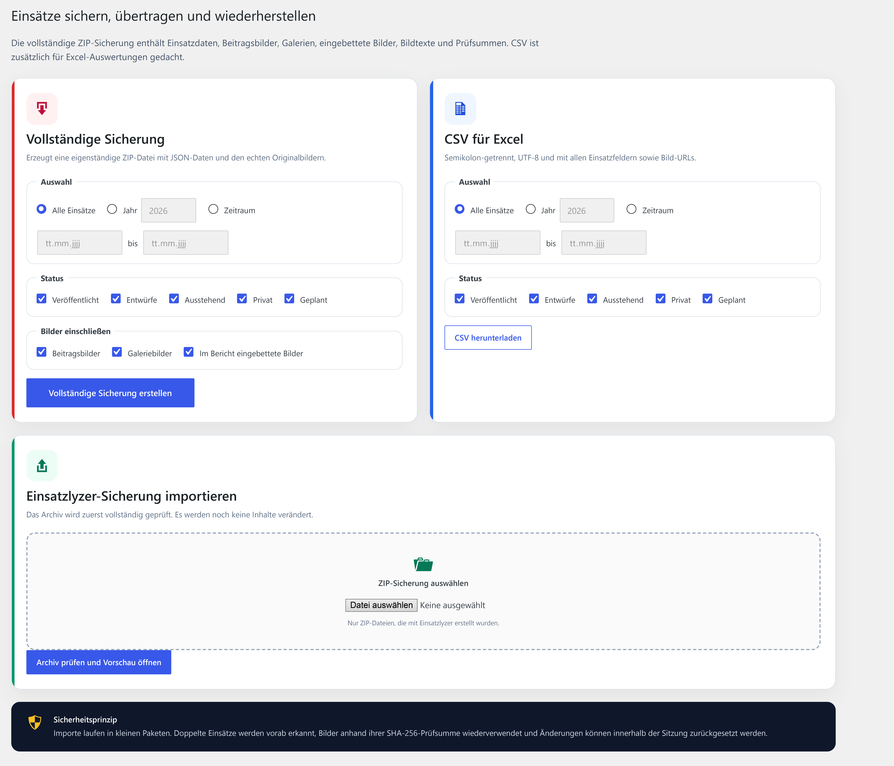

# Einsatzlyzer

**Moderne Einsatzverwaltung für WordPress – entwickelt für Feuerwehren und Hilfsorganisationen.**

Einsatzlyzer entstand, weil es im Joomla-Umfeld bereits ausgereifte Lösungen für die Verwaltung und Darstellung von Einsatzberichten gab, im WordPress-Umfeld aber keine für den konkreten Bedarf vergleichbare, umfassende Lösung gefunden wurde. Deshalb wurde Einsatzlyzer als eigenständiges WordPress-Plugin entwickelt und über viele Entwicklungsstufen kontinuierlich erweitert.

Die aktuelle Version verbindet eine übersichtliche Datenerfassung im WordPress-Backend mit einem responsiven Einsatzarchiv, modernen Einzelseiten, Bildergalerien, OpenStreetMap-Karten, Filtern sowie vollständigem Import und Export.

## Aktuelle Version

**Einsatzlyzer 9.7.0**

## Vorschau

### Moderne Einsatzverwaltung im WordPress-Backend

Übersichtliche Einsatzliste mit Vorschaubildern, Filtern, Statusanzeigen und Vollständigkeitsprüfung.

[](docs/screenshots/admin-uebersicht.jpg)

### Einsatzarchiv mit Übersichtskarte

Alle gefilterten Einsätze können zusätzlich auf einer interaktiven OpenStreetMap-Karte dargestellt werden.

[](docs/screenshots/einsatzarchiv-mit-karte.jpg)

### Modernes Einsatzarchiv

Responsive Einsatzkarten mit Bildern, Einsatzarten, Kurzberichten und Seitennavigation.

[](docs/screenshots/einsatzarchiv.jpg)

### Strukturierte Eingabemaske

Einsatzzeiten, Kräfte, Fahrzeuge, Bilder, Karte und weiterführende Links werden übersichtlich verwaltet.

[](docs/screenshots/einsatzbericht-bearbeiten.jpg)

### Sicherung, Import und Export

Vollständige ZIP-Sicherungen inklusive Einsatzdaten und Bildern sowie zusätzlicher CSV-Export.

[](docs/screenshots/import-export.jpg)

## Hauptfunktionen

### Einsatzverwaltung im Backend

- eigener öffentlicher Inhaltstyp für Einsatzberichte
- strukturierte Eingabe von Alarmierung, Einsatzzeiten, Einsatzort, Stichwort, Bericht, Fahrzeugen und beteiligten Einheiten
- Einsatzort direkt auf einer Karte auswählen
- manuelle oder automatisch erzeugte Einsatznummer
- Beitragsbild und Bildergalerie
- Bildquelle, weiterführende Links und zusätzliche Einsatzinformationen
- kompakte Einsatzübersicht mit Vorschaubildern und Statusanzeigen
- Filter nach Jahr, Einsatzart und fehlenden Angaben
- erweiterte Suche nach Ort, Stichwort und Einsatznummer

### Einsatzarchiv im Frontend

- responsives Karten- und Kachellayout
- Suche nach Stichwort, Ort und Bericht
- Filter nach Jahr und Einsatzart
- Seitennavigation für umfangreiche Archive
- einblendbare Gesamtkarte mit Einsatzmarkern und Clustern
- aktive Filter ohne vollständiges Neuladen der Seite

Verwendeter Shortcode:

```text
[ffl_einsatz_liste_komplett]
```

### Einzelne Einsatzberichte

- moderner Bild-Kopfbereich
- Einsatzdaten, Kurzfassung und ausführlicher Bericht
- beteiligte Fahrzeuge und Einheiten
- Bildergalerie mit Lightbox
- Karte des Einsatzortes
- verwandte Einsätze
- Teilen über WhatsApp, Facebook, E-Mail und Link
- optimierte Darstellung auf Desktop, Tablet und Smartphone

### Karten und Datenschutz

- OpenStreetMap und Leaflet
- kein Google-Maps- oder HERE-API-Schlüssel erforderlich
- kein Abrechnungskonto notwendig
- genaue, angenäherte oder ausgeblendete Einsatzposition je Bericht
- optionale Luftlinienentfernung vom Feuerwehrhaus
- externe Routenplanung über OpenStreetMap
- der Standort des Besuchers wird nicht abgefragt oder gespeichert

### Import und Export

- vollständiger ZIP-Export von Einsatzberichten und Bildern
- Sicherung von Beitragsbildern, Galerien und eingebetteten Berichtsbildern
- technische Prüfung durch SHA-256-Prüfsummen
- Duplikaterkennung über stabile Kennungen und Fingerabdrücke
- Importvorschau mit Strategien zum Überspringen, Aktualisieren oder Kopieren
- optionales Vorab-Backup und Rücksetzung einer Import-Sitzung
- Excel-kompatibler CSV-Export
- Importprotokoll als Textdatei

### Suchmaschinen und Social Media

- öffentliche, direkt aufrufbare Einsatzberichte
- Canonical-URL und Meta-Beschreibung
- Open-Graph- und Social-Media-Vorschaubilder
- Unterstützung für Yoast SEO, Rank Math und SEOPress
- strukturierte HTML-Ausgabe
- keine eigene Sitemap; Einsatz-URLs können durch ein separates Sitemap- oder SEO-Plugin aufgenommen werden

### Theme- und Elementor-Integration

- normaler Header und Footer des aktiven WordPress-Themes
- optionale gespeicherte Elementor-Vorlagen für Einsatz-Einzelseiten
- Elementor Pro ist dafür nicht erforderlich
- bestehende Seiten, Beiträge und Theme-Builder-Bedingungen bleiben unberührt

## Installation

1. Die Datei `einsatzlyzer-9.7.0.zip` in WordPress unter **Plugins → Installieren → Plugin hochladen** auswählen.
2. Plugin installieren und aktivieren.
3. Unter **Einsatzlyzer → Einstellungen** die Organisation, die Einsatzübersichtsseite und bei Bedarf den Standort des Feuerwehrhauses eintragen.
4. Eine öffentliche WordPress-Seite anlegen und dort den Shortcode `[ffl_einsatz_liste_komplett]` einfügen.
5. Diese Seite anschließend in den Einsatzlyzer-Einstellungen als Einsatzübersicht auswählen.

Für den ZIP-Import und -Export muss auf dem Server die PHP-Erweiterung `ZipArchive` verfügbar sein.

## Aktualisierung

Vorhandene Einsatzberichte und ihre Metadaten bleiben bei einem normalen Plugin-Update erhalten. Vor größeren Änderungen wird trotzdem ein vollständiges Backup der WordPress-Dateien und Datenbank empfohlen.

## Versionsgeschichte

Die frühen Entwicklungsstände wurden zunächst in der Versionsreihe 1.x aufgebaut. Nach einem umfassenden technischen und gestalterischen Neuaufbau wurde die modernisierte Entwicklungsreihe unter 9.x fortgeführt. Nicht jeder interne Zwischenstand wurde als eigene öffentliche Version herausgegeben.

Die vollständige Übersicht steht in [CHANGELOG.md](CHANGELOG.md).

## Lizenz

Einsatzlyzer wird unter der Lizenz **GPL-2.0-or-later** veröffentlicht. Drittanbieterbestandteile behalten ihre jeweiligen eigenen Lizenzen. Weitere Hinweise stehen in [THIRD_PARTY_NOTICES.md](THIRD_PARTY_NOTICES.md).

## Autor

**Ralf Ebert**
